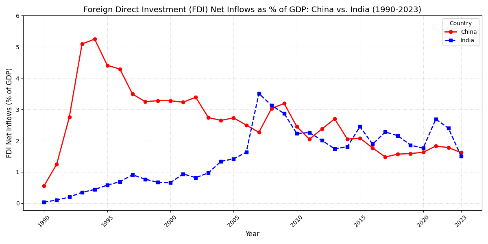

# 📈 Economics & Geopolitical Data Visualizations

[](https://www.python.org/)
[](https://opensource.org/licenses/MIT)
[](http://makeapullrequest.com)
[](https://discord.com/invite/jc4xtF58Ve)

Transforming complex global datasets into insightful, animated, and interactive visual stories. This repository contains a curated collection of Python scripts leveraging **Matplotlib**, **Pandas**, and **World Bank data** to explore macroeconomics, tech trends, and geopolitical shifts.

---

## 🌟 Key Features

- **Animated Comparisons:** Dynamic time-series animations showing economic convergence and divergence (e.g., China vs. USA).
- **Macroeconomic Insights:** Visualizations of GDP (PPP), FDI, Trade, and Energy costs across G20, BRICS, and G7.
- **Tech & Corporate Analysis:** Tracking the meteoric rise of AI startups, Big Tech headcount, and SaaS vs. GDP projections.
- **Demographic Trends:** Population density, workforce participation, and wage gaps.
- **Automated Data Fetching:** Many scripts fetch the latest data directly from the **World Bank API**.

---

## 📊 Gallery

| China vs India: FDI vs GDP | Renewable Growth Comparison | SaaS vs World GDP |
|:---:|:---:|:---:|
|  |  |  |

> *Note: More animations and plots are generated dynamically by running the scripts.*

---

## 📂 Topic Index

Explore the scripts based on your area of interest:

### 🌍 Macroeconomics & Geopolitics
| Topic | Scripts |
| :--- | :--- |
| **GDP & Convergence** | `brics_vs_g7_gdp.py`, `china_vs_usa_gdppc_ppp_animate.py`, `EU_China_convergence.py`, `india_vs_china_vs_usa_gdppc_animate.py`, `southasiagdppc.py` |
| **Trade & FDI** | `chinas_crude_imports.py`, `fdi.py`, `fdi_vs_immigrants.py`, `india_crude_import.py` |
| **Energy & Resources** | `china_vs_usa_energy_price.py`, `cheapest_renewable_energy.py`, `natural_resopurce_per_capita.py`, `us_china_renewable.py`, `rare_earth_metals_per_capita.py` |
| **Infrastructure** | `China_high_speed_rail.py`, `indian_highway_construction_rate.py` |

### 💻 Technology & Industry
| Topic | Scripts |
| :--- | :--- |
| **Artificial Intelligence** | `ai_company_valuations.py`, `ai_startups_revenue.py`, `swe_vs_ai_jobs.py`, `ai_energy_animate.py` |
| **Big Tech** | `FAANG_headcount.py`, `bigtech_employee_count_by_year.py`, `bigsemiconductor_employee_count_by_year.py` |
| **Digital Platforms** | `You_vs_Tik.py`, `youtube_cpm.py` |
| **SaaS** | `saas_vs_gdp.py` |

### 👥 Society & Environment
| Topic | Scripts |
| :--- | :--- |
| **Population** | `population_density.py`, `population_india_similar_sized.py`, `population_density_major_economies.py` |
| **Incomes & Labor** | `US_vs_India_median_wage.py`, `houshold_incomes_indians_vs_chinese.py`, `women_participation_workforce_gdp_per_capita_corelation.py` |
| **Environment** | `southasiaAQI.py`, `datacenter_power_share.py` |
| **Education** | `india_engg_vs_med_seats.py` |

---

## 🚀 Getting Started

### Prerequisites

- **Python 3.7+**
- **FFmpeg:** Required for saving animations as `.mp4`.
  - *Windows:* `choco install ffmpeg` or download from [ffmpeg.org](https://ffmpeg.org/download.html).
  - *macOS:* `brew install ffmpeg`
  - *Linux:* `sudo apt install ffmpeg`

### Installation

1. **Clone the repo:**
   ```bash
   git clone https://github.com/Mr-Innovation/economics_plots.git
   cd economics_plots
   ```

2. **Install dependencies:**
   ```bash
   pip install -r requirements.txt
   ```

### Running a Visualization

Simply run any script to generate its corresponding plot or animation:

```bash
# Generate a static plot
python ai_company_valuations.py

# Generate an animated MP4 (Requires FFmpeg)
python china_vs_usa_gdppc_ppp_animate.py
```

---

## 📈 Star History

[](https://www.star-history.com/#ishandutta2007/economics_plots&type=date&legend=top-left)

---

## 🤝 Contributing

Contributions are welcome! Whether it's adding a new script, improving existing ones, or fixing a bug.

1. Fork the Project.
2. Create your Feature Branch (`git checkout -b feature/AmazingVisualization`).
3. Commit your Changes (`git commit -m 'Add some AmazingVisualization'`).
4. Push to the Branch (`git push origin feature/AmazingVisualization`).
5. Open a Pull Request.

---

## 💬 Connect & Support

- **Discord:** [Join our community](https://discord.com/invite/jc4xtF58Ve)
- **Twitter:** [@ishandutta2007](https://twitter.com/ishandutta2007)
- **Sponsor:** [Support the development on GitHub](https://github.com/sponsors/ishandutta2007)

## 📄 License

Distributed under the MIT License. See `LICENSE` for more information.
